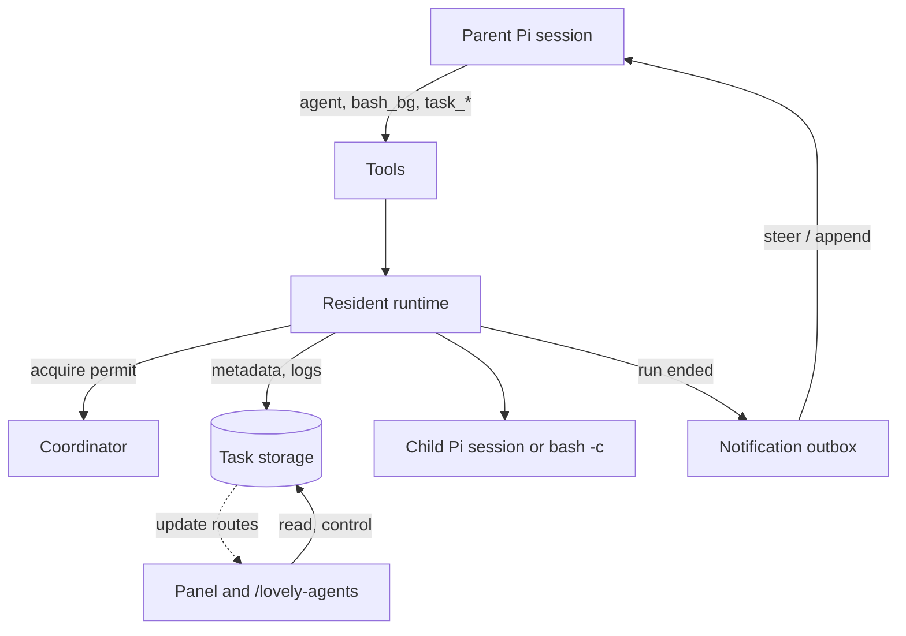
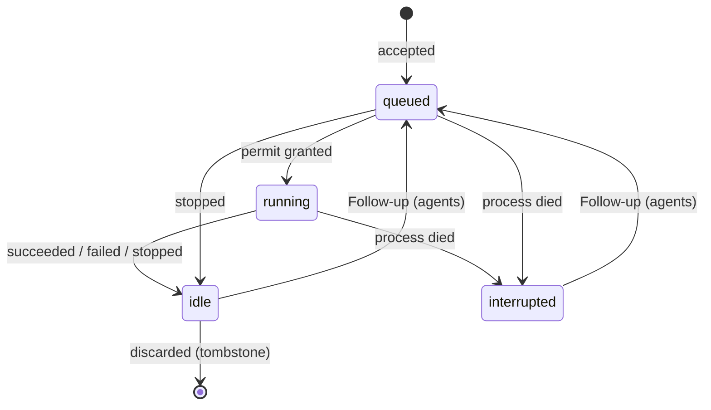
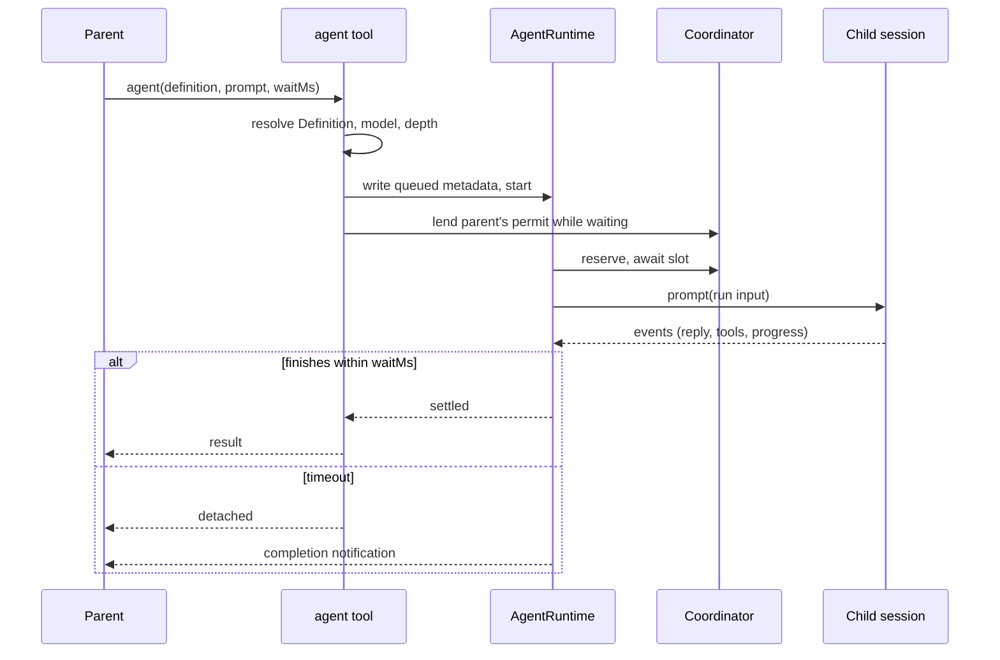

# Code

Pi package for durable, in-process agent orchestration. A parent Pi session
delegates work to child agents (Pi SDK sessions in the same process) and to
background Bash commands. Both are **tasks**: durable records on disk with the
same inspect / input / stop / discard controls, a scheduler slot while they
run, and a notification back to the parent when they end.

## How it works



- **Tools** validate, durably accept the task (metadata written before anything
  runs), then hand it to a **resident runtime** (`AgentRuntime`, `BashRuntime`).
- The runtime waits for a **coordinator** permit, runs the work, streams
  progress into the task's metadata, and settles exactly one terminal outcome.
- The tool call waits up to `waitMs`, then **detaches**; the work continues.
  A detached run (and every Follow-up) leaves a durable **notification**, which
  is steered into the parent and acknowledged only once seen in its transcript.
- Disk is the source of truth for task state: every transition is a
  read-check-write of `metadata.json`, and tools and UI always re-read it.
  Memory holds only what cannot be durable: live handles, in-process locks,
  callbacks, and liveness (the residents map; `running` on disk proves nothing).
- That process-wide memory (coordinator, write queues, routes, live Bash groups)
  lives on `globalThis` under `Symbol.for` keys, so `/reload` swaps the
  extension instance without losing running work.

### Task lifecycle



`interrupted` is only assigned by startup reconciliation: work found active
with no resident runtime. Nothing is ever restarted automatically. Discard is
a tombstone (`discardedAt`); files never move and results stay readable.
Provider quota / rate-limit errors are ordinary `failed` runs.

### One agent call



Follow-ups (`task_input`) are acknowledged immediately and queue behind the
active run (max 32); settlement atomically promotes the next one. Each run is a
separate prompt in the same child session. An idle runtime disposes; a later
Follow-up cold-loads the session from the recipe retained in metadata.

### Storage

```
.pi/lovely-agents/            (.gitignore: *)
  <parent-session-id>/        one partition per owning session
    .lease                    PID/token ownership of the partition
    a_1234abcd/               agent task
      metadata.json           current snapshot (schema v3)
      session.jsonl           Pi's authoritative transcript
      history.md              human-readable inputs/replies/tool summaries
      runs/<n>.json           final reply + outcome of run n
    b_1234abcd/               bash task: metadata.json, history.md, output.log
```

A child agent's own tasks live in the partition named by its `childSessionId`;
that is how task trees are walked (stop, discard, prune, descendant counts).

## Layout

- `index.ts`: registration, session wiring, notification route, `/lovely-agents`
- `agent.ts`: `agent`, `task_input`, `task_stop`, `task_discard`; `AgentRuntime`
- `bash.ts`: `bash_bg`; `BashRuntime`
- `child-session.ts`: child SDK session, tool policy, prompt composer, `task_update`
- `coordinator.ts`: process-global permits, residents, routes, session contexts
- `state.ts`: metadata schema, paths, atomic writes, mutation lanes, leases, logs,
  retained-output reads
- `lifecycle.ts`: tree stop, discard, startup reconciliation
- `notifications.ts`: outbox creation, delivery, observation, reconciliation
- `tools.ts`: `agent_roster`, `task_list`, `task_output`
- `config.ts`, `definitions.ts`: settings/models; Definition discovery and trust
- `management.ts`, `task-panel.ts`, `rendering.ts`: TUI
- `updates.ts`, `utils.ts`: refresh routes; shared helpers
- `prune.ts`: dry-run-first deletion of discarded trees, from `/lovely-agents`
- `skills/`: delegation guidance and Definition authoring; `README.md` is for humans

ESM; Pi discovers `./extensions` and `./skills` from the manifest. Pi packages
are peer dependencies (locally `bun link`ed from `../pi-mono`); Lovely Config is
pinned and bundled.

## Details

### Tools, config, trust

Tool schemas and visibility are static; tools register once. Pi validates
arguments against the schema before `execute`, so handlers check only what a
schema cannot express (byte limits, NUL, nonblank). Limits are enforced at
execution: `allowAgents` without remaining depth and `bash_bg` with
`backgroundBash` off fail explicitly. Tools are hidden only on a lease conflict.

`xl0-pi-lovely-agents.json` merges user then workspace scope through Lovely
Config. `models` adds choices to the parent model; unavailable entries warn and
are skipped without dropping the rest, and a nonempty all-unavailable selection
does not fall back to the parent. `fast`/`smart`/`workhorse` aliases pair a model
with a thinking level, default disabled, and fail rather than reroute when
unavailable. Integer limits are re-checked because ranged number fields accept
fractions. Concurrency limits apply live; both pools default to 4.

Project-controlled inputs (`.pi/agents`, workspace config) need real trust: Pi
reports projects without trust-requiring resources as trusted without asking,
and these are not among them. `projectResourcesTrusted` accepts Pi's answer
only when it evaluated trust, else requires a saved `/trust` decision. Ignored
resources warn. Ancestor `.pi/agents` owned by another user are skipped.

Definitions are rescanned on every use. The nearest trusted project directory
shadows user Definitions by declared name, even when the project one is
invalid; same-scope duplicates invalidate the name. Aliases resolve at
creation, not discovery.

### Child sessions

Selection precedence: call, Definition, parent. A call-selected alias supplies
its thinking ahead of the Definition's; explicit call thinking always wins;
explicit model IDs never inherit alias thinking. Only concrete model identity
and clamped thinking persist, so alias edits never retarget existing sessions.

Explicit Definition `tools` are a hard allowlist; omitted means normal
built-ins and extensions. Unless `allowAgents` and remaining depth both permit
delegation, `agent` and `agent_roster` are excluded in the SDK registry. Depth
and `allowAgents` are registered per session in the coordinator before child
extensions start.

The Definition body is Pi's custom prompt, so Pi renders append text, context
files, skills, and cwd itself. Pi omits its tool list and rules for custom
prompts; a hidden first extension adds them back through
`systemPromptOptions.sections` (needs Pi newer than 0.85.1; Pi does not export
its rule builder, so `definitionPromptSections` mirrors it). The same extension
registers child-only `task_update({ progress })`. The handle's `prompt` binds the
run ID through async-local storage, so late callbacks cannot adopt a later run.
A lifetime signal aborts before SDK disposal (which emits no
`session_shutdown`) so the child's extension instance unbinds its routes.

### Scheduling

The coordinator is an acceptance-ordered semaphore. Managed runs carry their
permit in async-local context; a synchronous wait on a descendant (or a timed
`task_output`) lends it and reacquires FIFO afterwards. Overlapping lends from
parallel tool calls share one released slot; only the last to finish
reacquires. Waiters sort by acceptance order, which is stored with each run,
so a promoted Follow-up queues ahead of later-accepted work; it holds no
position while its task is still busy with an earlier run. Bash uses a
second instance of the same class. The coordinator object survives reload, so
changing its shape needs a version bump and a process restart.

### Metadata and durability

One `metadata.json` per task, a v3 discriminated union (`a_` agent, `b_` bash),
validated against schema, path identity, and cross-field rules on every read
and write. No backward compatibility beyond safety checks: other versions are
an `unsupported-version` diagnostic, never migrated or discardable via tools.

All mutations go through a per-task, process-global lane and an atomic
write (private temp file, fsync, rename, directory fsync). The lane is what
makes races safe: completion vs stop settle by matching the durable run ID
(first wins), input acceptance is checked inside the lane, and late stream
events are fenced by run ID. Settlement writes `runs/<n>.json` before
publishing the terminal snapshot, so a crash can lose an unpublished result but
never publish settlement without it.

Agent metadata retains the immutable session recipe (Definition prompt, tool
policy, context exclusion, scoped models) plus per-run observability:
`latestReply`, `lastActivity` (observed work only), child-authored `progress`,
`effectiveSystemPrompt` (captured at `agent_start`, never model-visible),
`inputPreview` (UI only). A new run clears them. `lastSettledRun` differs from
`lastRunSequence`, which counts accepted-but-unrun Follow-ups. Streaming reply
snapshots are throttled to two writes per second; final replies and tool
activity flush at once, inside the same write-chain link that settlement awaits.

Leases: the `.lease` file is the only ownership record. It holds the PID and a
per-process token, published by no-overwrite link, so every extension runtime
in the process recognizes it without an in-memory registry. A live foreign PID
is a conflict (tools hidden, persistent footer, `/resume` hint); a dead PID, or
this PID with another token (PID reuse), is reclaimed. Release verifies the token. Reload keeps the lease;
semantic shutdown releases it.

### Agent runtime

Accepts input inside the mutation lane: a Steer goes to Pi's queue only while
the run is streaming, otherwise it deterministically becomes a Follow-up. Steers
are logged only once their user message is observed, so stop/crash can drop
them. Cancellation before detachment stops the run and its descendants; after
detachment the run is on its own. Child failures are task outcomes, not tool
errors.

### Bash

`bash -c` in its own process group (`detached`), inherited env, POSIX only.
Defaults to immediate detachment. Output flows through one no-follow
`output.log` handle with backpressure; a 2,000-line/50 KiB UTF-8-safe tail is
mirrored into metadata with a sticky truncation flag. Stdin writes serialize
and log delivery; a write submitted before cancellation cannot be undone. Durable
`running` precedes spawn, so stdin checks the durable state and then waits for
the child to exist. The group is
killed on stop, on shell exit (leftover jobs would hold the pipes), and on
normal process exit. SIGKILL of Pi or `setsid` escapes need OS supervision;
restart never signals a stored PID or replays a command. A failed log close
keeps the resident reachable so stop/discard can retry.

### Notifications

Created inside the settling mutation for Follow-up runs, detached initial
runs, and reconciled interruptions; never for synchronous results or explicit
stops. IDs are deterministic (`task:run:type`). Delivery steers a custom
message into the exact parent and wakes it if idle, except an idle *managed
child*, which gets the message appended without a turn (a turn there would run
outside its runtime's permit). `message_end` in the parent marks delivery.
Queue clearing (Esc, run end) can drop a steered notice silently, so
`agent_end` clears in-flight suppression and re-reconciles against the
transcript; session start does the same. Previews come from the run's latest
reply only (agents: first 2 KiB, Bash: last 2 KiB) and include the exact
`task_output` call. Manual discard sends a separate context notice.

### Stop, discard, shutdown, prune

`task_stop` aborts or cancels, clears Follow-ups, recurses into descendants,
and keeps the session usable. `task_discard` stops then tombstones the subtree;
concurrent discards share one operation. Tasks without a resident settle
through one path in `lifecycle.ts`, shared with startup reconciliation.
Quit/new/resume/fork stop the owned tree before releasing leases; failed
cleanup keeps its leases for retry. Reload skips all of this.

The pruner (`/lovely-agents` → Prune discarded tasks: dry run, confirm, apply)
takes every partition lease in the workspace, refuses another process's live
lease, leaves leases this process already held, and deletes only discarded,
settled, fully-notified trees, descendants first. Unknown or
malformed records, symlinks, ambiguous ownership, and retained descendants
block removal.

### Inspection and UI

`task_list` reads only the caller's partition: tombstones hidden, corrupt
records isolated as diagnostics, one ordering everywhere (Agents before Bash,
active first, newest created first), plus a descendant count. `task_output`
returns one run's snapshot (2,000 lines/50 KiB), never pages; a timed read
stays pinned to the run it observed, so a later Follow-up cannot extend or
replace it. Capacity numbers are held permits, not running-state counts.

Model-facing text is compact YAML-like output; structured data stays in tool
`details`. Collapsed `agent`/`bash_bg` calls render one row with the task ID
reserved before truncation; long results fold to head/tail until expanded;
notification bodies stay hidden until expanded. Rendering never changes what
the model sees.

The below-editor panel shows active rows passively and, focused (Down on an
empty editor), all direct tasks and diagnostics in a five-row window; both
modes use one row formatter, and selection follows task identity. Task actions:
live output, inputs/history, captured system prompt, Follow-up/Steer, stdin/EOF,
stop, discard. Text and live output share one scroll viewport; Bash follows the
tail until scrolled up. Surfaces refresh from process-global update routes on
durable writes and capacity changes, never by polling; disposal fences
in-flight refreshes.

## Tooling and release

Strict TypeScript (`tsgo`), Bun tests, Biome; `bun run check` runs all three.
Dependencies are exact-pinned. Tests prioritize lifecycle/ownership safety and
reported regressions; avoid dependency tests, UI descriptor checks, and exact
presentation text. Task fixtures live in `tests/lovely-agents/test-helpers.ts`.

`bun run release` verifies, bumps, commits only the release files, and pushes
a `v*` tag; CI stages the package on npm with OIDC provenance and creates the
GitHub Release; the driver then asks for 2FA to approve the staged version.
